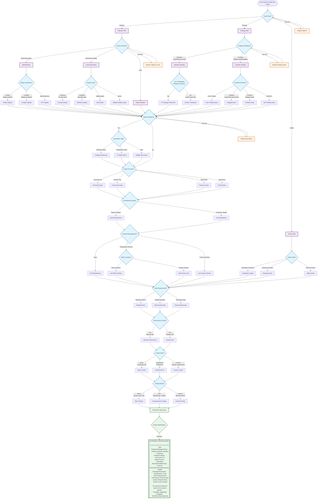

# Pine Script Project Scoping Flow

This deterministic flow diagram helps the pine-manager agent gather the minimum necessary information to properly scope any Pine Script project.

## Flow Diagram

## Question Flow Logic

### Minimal Path Examples

#### Quick Indicator
1. Script Type? → Indicator
2. Purpose? → Signal Generation
3. Complexity? → Simple
4. Automation? → No
5. Project Purpose? → Personal
6. Dev Speed? → Rapid Prototype
7. Dependencies? → None
8. Data? → Standard OHLCV
9. Performance? → No
10. Visuals? → Basic
11. Testing? → Basic

**Result**: Simple indicator, 11 questions, ~2 minutes

#### Production Strategy
1. Script Type? → Strategy
2. Trading Complexity? → Standard
3. Use TV Functions? → Yes
4. Automation? → Yes → Webhooks
5. Purpose? → Sell Access
6. Dev Speed? → Production Quality
7. Dependencies? → TradingView Libraries
8. Data? → Multiple Symbols
9. Performance? → Yes
10. Visuals? → Professional
11. Testing? → Full

**Result**: Premium strategy, 12 questions, ~3 minutes

### Adaptive Questioning

The flow adapts based on answers:
- If user selects "Not sure" → Provide explanation, re-ask
- If user selects simple options → Skip advanced questions
- If user selects complex options → Ask detailed follow-ups

### Project Types Identified

1. **Simple Indicators** (5-10 questions)
   - Basic calculations
   - Single-purpose
   - Quick development

2. **Complex Indicators** (10-15 questions)
   - Multi-timeframe
   - Multiple purposes
   - Advanced features

3. **Standard Strategies** (10-15 questions)
   - TradingView framework
   - Single asset
   - Normal position management

4. **Complex Strategies** (15-20 questions)
   - Custom framework
   - Multiple assets
   - Advanced position management
   - Pairs/Hedging/Portfolio

5. **Libraries** (8-12 questions)
   - Reusable functions
   - Public/Private
   - Documentation needs

## Implementation in pine-manager

The pine-manager agent will:
1. Start with Q1 (Script Type?)
2. Follow the flow based on answers
3. Skip irrelevant branches
4. Collect all answers
5. Generate project specification
6. Create appropriately named file
7. Assign required agents
8. Begin development workflow

## Benefits

- **Deterministic**: Same inputs always lead to same outputs
- **Flexible**: User can provide minimal or detailed information
- **Efficient**: Only asks relevant questions
- **Complete**: Covers all project variations
- **Clear**: Each question has a specific purpose